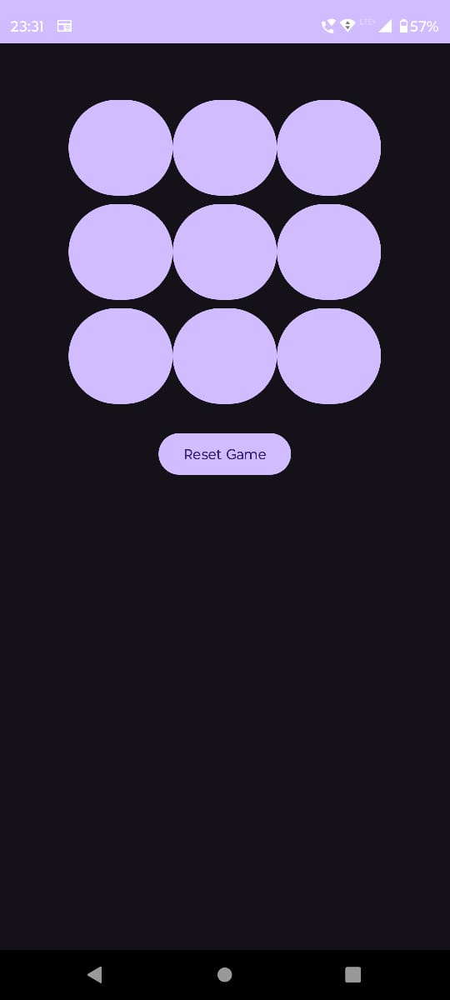

# 🎮 Tic-Tac-Toe Game (Android)

# 📱 Android App - Prototype Overview

##  First Version
The initial prototype of our Android app focused on functionality and core features. The UI was minimalistic, ensuring smooth navigation and usability.

**Key Features:**A Next.js project bootstrapped with create-next-app, designed for building fast and modern web applications
- Basic UI layout with essential buttons and navigation
- Core functionalities implemented
- Default theme and color scheme
# 📱 Android App - Prototype Overview

## 🏗 First Prototype
The initial prototype of our Android app focused on functionality and core features. The UI was minimalistic, ensuring smooth navigation and usability.

**Key Features:**
- Basic UI layout with essential buttons and navigation
- Core functionalities implemented
- Default theme and color scheme

---

## 🎨 Second Prototype - Updates & Enhancements
In the second prototype, we made significant design improvements based on user feedback. The major changes include:

### ✅ Changes Made:
- **Enhanced UI Styling:** Applied a modern theme with improved button styles and layouts.
- **Updated Logo:** Replaced the previous logo with a high-resolution, optimized version.
- **Refined Color Scheme:** Adjusted colors for better contrast and user experience.
- **Improved Navigation:** Streamlined UI elements for better accessibility.

---

